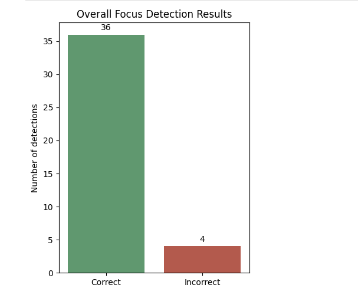
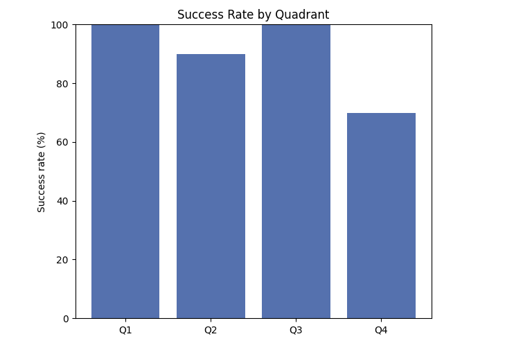
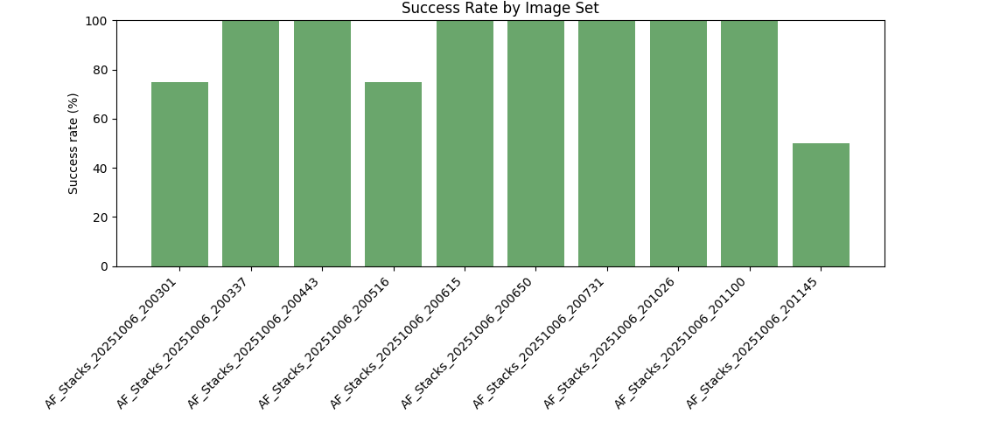

# Laplacian-Based Focus Detection

This project identifies the most focused image in each three-image quadrant. The dataset contains 10 image-set folders, four quadrants per folder, and three images per quadrant, giving 40 predictions and 120 individual focus scores.

## 2. How the Algorithm Works

For my focus detection algorithm I decided to go with a Laplacian Based approach beccause of its strength in picking up fine details and subtle edges. Although it has some downsides, specifically with being sensitive to noise and being computationally expensive, I still believe this is was one of the better approaches to this problem because of its general application in microscopy autofocus systems and the fact that I was familiar with Laplacian operators and kernels coming from a Math background.

The algorithm was developed incrementally and specifically tuned for the data that was to be processed through it. For example, I first implemented a simple laplacian based focus detector algorithm that preformed convolution between a 3x3 laplacian kernel and 3x3 windows of the processed images, but this yielded poor results due to noise from the data and the fact that large chunks of the images were not relevant to the analysis of the image since the data was split into different quadrants. From this, I added a Gaussian blur to reduce noise in the images and also added regions of interests, that cut off a part of the image based on which quadrant the image was in. From there I focused on tuning the Gaussian Blur to reduce noise further and allow for easier detection of edges in the data.

1. Each PNG image is converted to a numpy array.
2. A region of interest is selected to remove the half of the sensor image that is not relevant to the quadrant being evaluated. Q1 and Q4 use the right half, while Q2 and Q3 use the left half.
3. We first use a Gaussian Blur to filter out noise that would otherwise negatively impact the focus score. Each region is convolved with a 15×15 Gaussian kernel with a standard deviation of 2.5
4. A 3×3 Laplacian kernel is applied to the smoothed image. 
5. The variance of the Laplacian response is used as the focus score. A larger variance indicates that the image contains stronger edges and is therefore predicted to be more focused.
6. The image with the highest score among the three candidates is selected as the focused image.

The Gaussian kernel size was increased during development because the original 3×3 and 7×7 kernels did not suppress enough noise.

## 3. Focus Scores for Every Image
| Folder | Quadrant | X−1 score | X score | X+1 score | Predicted image | Ground truth | Result |
|---|:---:|---:|---:|---:|---|---|:---:|
| 200301 | Q1 | 0.376370 | 0.396674 | 0.370559 | `diag_X_V59.210.png` | `diag_X_V59.210.png` | ✓ |
| 200301 | Q2 | 0.374916 | 0.392817 | 0.378326 | `diag_X_V51.810.png` | `diag_X_V51.810.png` | ✓ |
| 200301 | Q3 | 0.353661 | 0.361552 | 0.350666 | `diag_X_V56.200.png` | `diag_X_V56.200.png` | ✓ |
| 200301 | Q4 | 0.363636 | 0.373775 | 0.361952 | `diag_X_V55.240.png` | `diag_X+1_V56.240.png` | ✗ |
| 200337 | Q1 | 0.370291 | 0.374402 | 0.396030 | `diag_X+1_V59.210.png` | `diag_X+1_V59.210.png` | ✓ |
| 200337 | Q2 | 0.375865 | 0.394485 | 0.375346 | `diag_X_V51.810.png` | `diag_X_V51.810.png` | ✓ |
| 200337 | Q3 | 0.353245 | 0.353159 | 0.362675 | `diag_X+1_V56.200.png` | `diag_X+1_V56.200.png` | ✓ |
| 200337 | Q4 | 0.369144 | 0.360532 | 0.367686 | `diag_X-1_V55.240.png` | `diag_X-1_V55.240.png` | ✓ |
| 200443 | Q1 | 0.375364 | 0.399323 | 0.373624 | `diag_X_V59.210.png` | `diag_X_V59.210.png` | ✓ |
| 200443 | Q2 | 0.394759 | 0.375613 | 0.377709 | `diag_X-1_V51.810.png` | `diag_X-1_V51.810.png` | ✓ |
| 200443 | Q3 | 0.351290 | 0.355621 | 0.359962 | `diag_X+1_V56.200.png` | `diag_X+1_V56.200.png` | ✓ |
| 200443 | Q4 | 0.371198 | 0.361203 | 0.362094 | `diag_X-1_V55.240.png` | `diag_X-1_V55.240.png` | ✓ |
| 200516 | Q1 | 0.387207 | 0.370665 | 0.368837 | `diag_X-1_V59.210.png` | `diag_X-1_V59.210.png` | ✓ |
| 200516 | Q2 | 0.379191 | 0.376779 | 0.378738 | `diag_X-1_V52.810.png` | `diag_X-1_V52.810.png` | ✓ |
| 200516 | Q3 | 0.356809 | 0.352416 | 0.360986 | `diag_X+1_V56.200.png` | `diag_X+1_V56.200.png` | ✓ |
| 200516 | Q4 | 0.363651 | 0.365746 | 0.363851 | `diag_X_V57.240.png` | `diag_X-1_V56.240.png` | ✗ |
| 200615 | Q1 | 0.374058 | 0.391398 | 0.374376 | `diag_X_V59.020.png` | `diag_X_V59.020.png` | ✓ |
| 200615 | Q2 | 0.377680 | 0.396823 | 0.377114 | `diag_X_V51.700.png` | `diag_X_V51.700.png` | ✓ |
| 200615 | Q3 | 0.351868 | 0.364921 | 0.353328 | `diag_X_V55.900.png` | `diag_X_V55.900.png` | ✓ |
| 200615 | Q4 | 0.365113 | 0.366625 | 0.364466 | `diag_X_V54.890.png` | `diag_X_V54.890.png` | ✓ |
| 200650 | Q1 | 0.373505 | 0.396445 | 0.378490 | `diag_X_V59.020.png` | `diag_X_V59.020.png` | ✓ |
| 200650 | Q2 | 0.373962 | 0.376536 | 0.387264 | `diag_X+1_V51.700.png` | `diag_X+1_V51.700.png` | ✓ |
| 200650 | Q3 | 0.368341 | 0.355043 | 0.350844 | `diag_X-1_V55.900.png` | `diag_X-1_V55.900.png` | ✓ |
| 200650 | Q4 | 0.363715 | 0.368361 | 0.367278 | `diag_X_V54.890.png` | `diag_X_V54.890.png` | ✓ |
| 200731 | Q1 | 0.140692 | 0.140996 | 0.147089 | `diag_X+1_V59.020.png` | `diag_X+1_V59.020.png` | ✓ |
| 200731 | Q2 | 0.143171 | 0.144549 | 0.142588 | `diag_X_V49.700.png` | `diag_X_V49.700.png` | ✓ |
| 200731 | Q3 | 0.137442 | 0.134015 | 0.134659 | `diag_X-1_V55.900.png` | `diag_X-1_V55.900.png` | ✓ |
| 200731 | Q4 | 0.137852 | 0.140219 | 0.138734 | `diag_X_V54.890.png` | `diag_X_V54.890.png` | ✓ |
| 201026 | Q1 | 0.246869 | 0.256482 | 0.248845 | `diag_X_V59.020.png` | `diag_X_V59.020.png` | ✓ |
| 201026 | Q2 | 0.248698 | 0.261130 | 0.248038 | `diag_X_V51.850.png` | `diag_X_V51.850.png` | ✓ |
| 201026 | Q3 | 0.232978 | 0.239700 | 0.233431 | `diag_X_V56.180.png` | `diag_X_V56.180.png` | ✓ |
| 201026 | Q4 | 0.240635 | 0.244910 | 0.239891 | `diag_X_V55.240.png` | `diag_X_V55.240.png` | ✓ |
| 201100 | Q1 | 0.244710 | 0.256739 | 0.247512 | `diag_X_V59.020.png` | `diag_X_V59.020.png` | ✓ |
| 201100 | Q2 | 0.256111 | 0.248758 | 0.245006 | `diag_X-1_V51.850.png` | `diag_X-1_V51.850.png` | ✓ |
| 201100 | Q3 | 0.232662 | 0.239459 | 0.234126 | `diag_X_V56.180.png` | `diag_X_V56.180.png` | ✓ |
| 201100 | Q4 | 0.244662 | 0.240209 | 0.238936 | `diag_X-1_V55.240.png` | `diag_X-1_V55.240.png` | ✓ |
| 201145 | Q1 | 0.245146 | 0.245248 | 0.250434 | `diag_X+1_V59.020.png` | `diag_X+1_V59.020.png` | ✓ |
| 201145 | Q2 | 0.247350 | 0.249099 | 0.248325 | `diag_X_V53.850.png` | `diag_X-1_V52.850.png` | ✗ |
| 201145 | Q3 | 0.240062 | 0.233102 | 0.234038 | `diag_X-1_V56.180.png` | `diag_X-1_V56.180.png` | ✓ |
| 201145 | Q4 | 0.237189 | 0.241899 | 0.243453 | `diag_X+1_V58.240.png` | `diag_X_V57.240.png` | ✗ |

## 4. Images Identified as Most Focused

Each entry below is the image label with the highest focus score in its quadrant. The complete filename for every prediction appears in the preceding table.

| Folder | Q1 | Q2 | Q3 | Q4 |
|---|:---:|:---:|:---:|:---:|
| 200301 | X | X | X | X |
| 200337 | X+1 | X | X+1 | X−1 |
| 200443 | X | X−1 | X+1 | X−1 |
| 200516 | X−1 | X−1 | X+1 | X |
| 200615 | X | X | X | X |
| 200650 | X | X+1 | X−1 | X |
| 200731 | X+1 | X | X−1 | X |
| 201026 | X | X | X | X |
| 201100 | X | X−1 | X | X−1 |
| 201145 | X+1 | X | X−1 | X+1 |

## 5. Correct and Incorrect Detections

The ground-truth filename for each quadrant was recorded in `ground_truth_files.csv`.

- **Correct detections:** 36
- **Incorrect detections:** 4

## 6. Overall Success Rate

The success rate was calculated as:

```text
Success rate = (correct detections / total image sets) × 100
             = (36 / 40) × 100
             = 90%
```

The algorithm therefore achieved an **overall success rate of 90%** on this dataset.

## 7. Performance Plots

The first plot shows the overall number of correct and incorrect detections:



The second plot compares success rates across the four quadrants:



The final plot shows the success rate for each of the ten image set folders:



## 8. Analysis of Failed Cases

The algorithm failed on four of the 40 image sets:

| Folder | Quadrant | Predicted | Ground truth | 
|---|:---:|---|---|
| 200301 | Q4 | `diag_X_V55.240.png` | `diag_X+1_V56.240.png` |
| 200516 | Q4 | `diag_X_V57.240.png` | `diag_X-1_V56.240.png` |
| 201145 | Q2 | `diag_X_V53.850.png` | `diag_X-1_V52.850.png` |
| 201145 | Q4 | `diag_X+1_V58.240.png` | `diag_X_V57.240.png` |

The parts where the algorithm failed most was on quadrants where there wasn't any relevant or significant edges or ob to be found. Specifically quadrants 3 and 4 proved to be most difficult with having data with not a lot of relevant edges to be found in them. Thus they produced focus socres all very close to one another. So the source of the failure comes from a lot of noise and no particular edges for the algorithm to detect.

Three of the four failures occurred in Q4. This quadrant frequently contains very few visible objects, so there was not enough meaningful data to categorize the images correctly with sensor noise dominating the focus score and providing incorrect results.

## 9. Conclusion and Expected Robustness

The final method achieved 90% accuracy, showing that a laplacian based approach paired with Gaussian Blurring is effective for most of the provided image sets. It was particularly reliable for Q1 and Q3, where it correctly classified all 20 image sets, and it also performed well on Q2.

I believe this method should transfer reasonably well to new similar sets with similar quadrant structure and heavy noise, however, it may require some tuning to images captured on different sensors due to the Gaussian Blur being specifically tuned to this data set and sensor data. The algorithm is also less dependable when a quadrant contains few visible objects or edges.

Another issue arises from the low margin predictions that the algorithm produces with some quadrants having a 1-2% difference in the focus scores between images. These results may be categorized as uncertain.

## Running the Project

Install the dependencies and run the evaluation from the project directory:

```bash
pip install -r requirements.txt
python main.py
```
